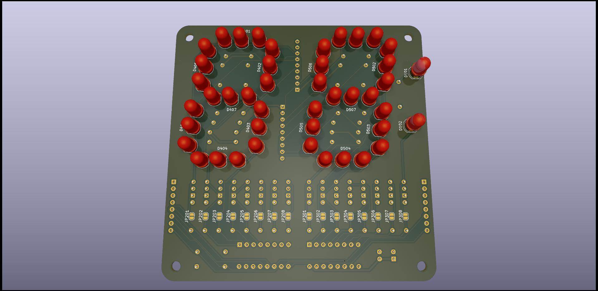

# 7 segment 2 digit board with 3 LEDs per segment

These are the design files for a 7 segment board for [Ancient 12 hour display](https://hackaday.io/project/184942-ancient-12-hour-display) but which can be used with modern 5mm LEDs.

## Versioning

Release March 2025

## Notes

Most components are installed on the back side and the LEDs are installed on the front side.

The board is designed to be cascadable by using the versatile 74HC595 shift register which only requires 3 lines to drive, plus power. Two boards stiched together with jumpers form 4 digits. You can see there is room for lots of driver transistors and base resistors. Those are only needed for these old LEDs due to their inefficiency and higher current draw. Modern LEDs with current draw 6 mA or less can be driven directly from the 74HC595 using the solder jumpers to bypass the transistors. The LED current limiting resistor is a resistor network which reduces component count but discrete resistors can be used instead if preferred. Remember that VDC - 3 x LED voltage drop should not exceed VCC.

## Authors

* **Ken Yap**

## License

See the [LICENSE](LICENSE.md) file for license rights and limitations (MIT).
